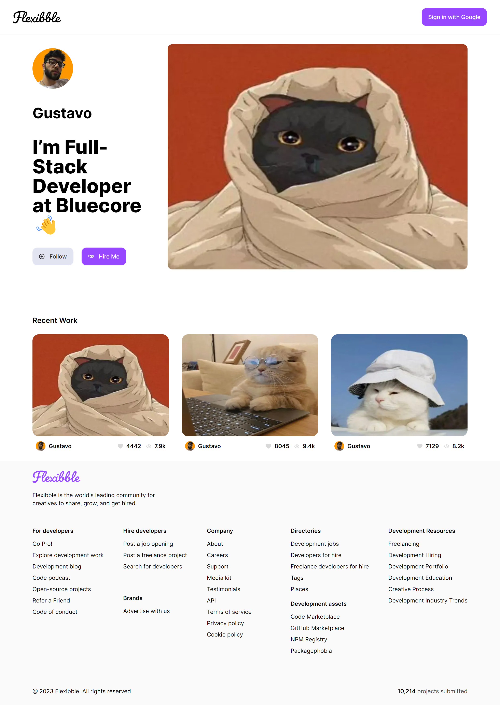

<h1 align="center"> Flexibble Dribbble Clone </h1>

Flexibble é um clone do Dribbble feito com Next.js, React, TypeScript, TailwindCSS e outras tecnologias. O projeto foi feito no intuito de aprimorar os conhecimentos em SSR, geração de sites estáticos, autenticação, manipulação de formulários, validação de dados, upload de arquivos, entre outros.

## 📌 Links

Você pode acessar o projeto em produção [aqui](https://socius-gustavohdab.vercel.app/).

<br>

<p align="center">
  <a href="#-sobre-o-projeto">Sobre o Projeto</a>&nbsp;&nbsp;&nbsp;|&nbsp;&nbsp;&nbsp;
  <a href="#-tecnologias">Tecnologias</a>&nbsp;&nbsp;&nbsp;|&nbsp;&nbsp;&nbsp;
  <a href="#-como-contribuir">Como Contribuir</a>&nbsp;&nbsp;&nbsp;|&nbsp;&nbsp;&nbsp;
  <a href="#-como-iniciar">Como Iniciar</a>&nbsp;&nbsp;&nbsp;|&nbsp;&nbsp;&nbsp;</a>
  <a href="#-preview-do-projeto">Preview do Projeto</a>&nbsp;&nbsp;&nbsp;&nbsp;&nbsp;&nbsp;</a>
</p>

<br>

## 🚀 Tecnologias

Este projeto foi desenvolvido com as seguintes tecnologias:

- [Next.js](https://nextjs.org/) para SSR e geração de sites estáticos.
- [React](https://reactjs.org) para a criação de componentes UI.
- [TypeScript](https://www.typescriptlang.org/) para adicionar tipos estáticos ao JavaScript.
- [TailwindCSS](https://tailwindcss.com/) e [Headlessui](https://headlessui.dev/) para estilização.
- [Next Auth](https://next-auth.js.org/) para autenticação.
- [Cloudinary](https://cloudinary.com/) para upload de imagens.
- [grafbase](https://grafbase.com) para o banco de dados.
- E outras bibliotecas e frameworks auxiliares.

## 💻 Sobre o Projeto

O Flexibble simula o site Dribbble, onde os usuários podem fazer login com o google, postar um projeto com Imagem, Título, Descrição e Tags, LinkedIn e GitHub e visualizar os projetos postados por outros usuários, além de poder visualizar o perfil de cada usuário e mandar e-mail para o mesmo.

---

Feito com ♥ por Gustavo Batista :wave: [LinkedIn](https://www.linkedin.com/in/gustavo-h-batista/) e [GitHub](https://github.com/gustavohdab)

---

## 👥 Como Contribuir

1. Faça um fork do projeto.
2. Crie uma nova branch com suas alterações: `git checkout -b my-feature`
3. Salve suas alterações e crie uma mensagem de commit contando o que você fez: `git commit -m "feature: My new feature"`
4. Envie suas alterações: `git push origin my-feature`

## 🚀 Como Iniciar

```bash
# clonar o repositório
git clone https://github.com/gustavohdab/flexibble.git
# ir para o repositório e:
npm install && npm run dev
```

## 🖼️ Preview do Projeto

<p align="center">
  
</p>